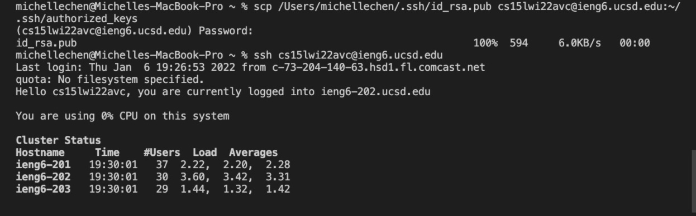

## Installing VScode

Navigate to VScode's website [Visual Studio Code](https://code.visualstudio.com/). Proceed to follow the instructions on the website and install Visual Studio Code. 
## Remotely Connecting 

After you successfully install Visual Studio Code, open a new Terminal. Find your course specific account in order to connect to the server computer on campus. Then proceed to use the command `ssh` followed by your account. Follow the instructions that follows and you will be able to connect to the server remotely!
## Trying Some Commands

As you now have connected to the server, you can try different commands and experiment with them by typing them into the terminal. In the picture above, the example commands are ls `lat` and `lat`. Which `ls` lists files in the directy and `ls -lat` provides more specific history regarding files opened. 
## Moving Files with scp

To move files to your remote computer, you will be using the command `scp`. After creating the file that you will be sending open the terminal and use the command `scp` followed by the file's name and your account. Follow the instruction such as entering your password. In the above example a file was transfered and we checked that by using command `ls`. 
## Setting an SSH Key 

To reduce time consumed by typing password use `ssh` key. On your domestic computer type in `ssh-keygen` in terminal to create a public key. In the screenshot, after I completed the above steps I connected to the remote computer again and typed `mkdir.ssh` into the terminal along with scp to transfer the key to the server. After that I was able to access the server without inputing a password repeatedly. 

## Optimizing Remote Running

There are many ways to perform commands faster and less time consuming. We can directly type the command after ssh'ing on the same line after the username. You can also use semicolons to eliminate the need to retype the commands.