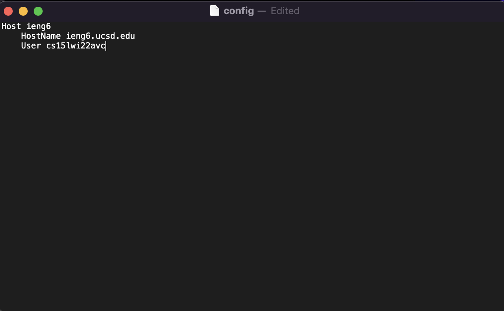
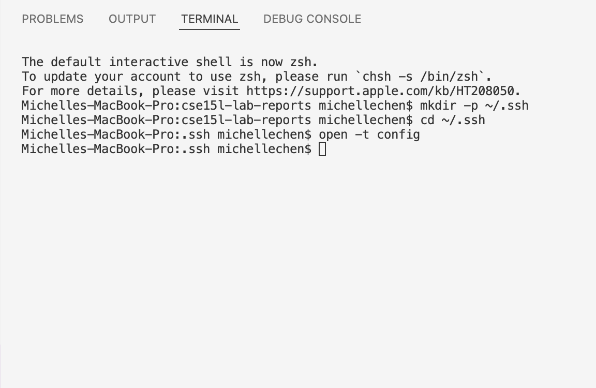
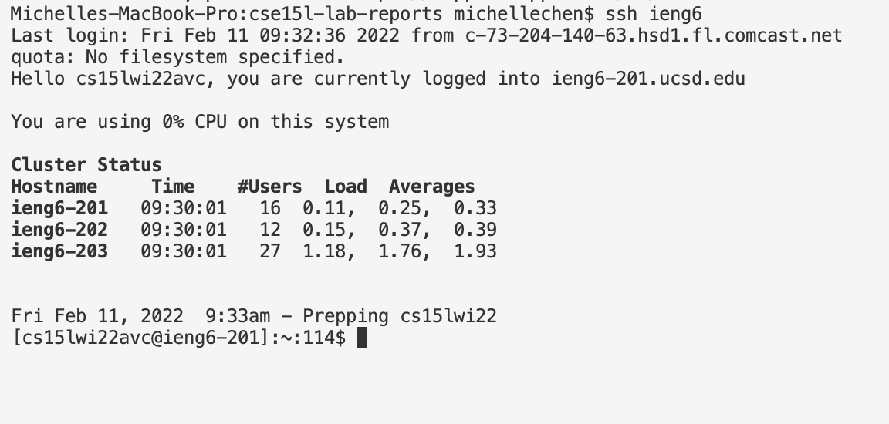
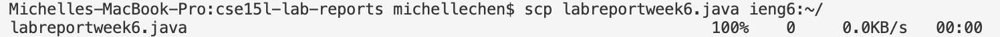
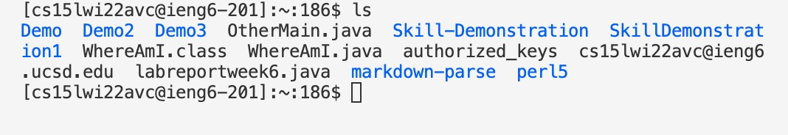

# Streamlining `ssh` Configuration 

## Editing `.ssh/config` file 

The image above shows my `.ssh/config` file. This files tells SSH what user will be used when logging into the remote server. To edit this file, open your terminal in VScode and create a `~/.ssh` directory using command `mkdir -p ~/.ssh`.Then use command `cd ~/.ssh` to go into the directory. Open the `.ssh/config` file with command `open -t config`. This will allow you to edit it. The image below shows the process in the terminal. 

## `ssh` to Remote Server 
After the the `.ssh/config` file is edited, I was able to log onto the remote server using command `ssh ieng6` shown in the image below. This is much shorter than typing out the entire username. 

## `scp` files
I was able to use `scp` command to copy a file over to my account using `ieng6` as shown in the image below. 

When using `ls` to check my directory on server, it shows the new file. 

