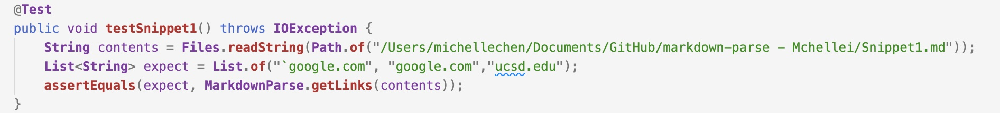
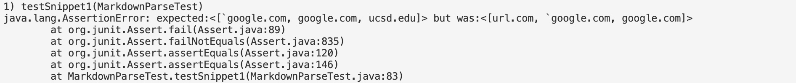
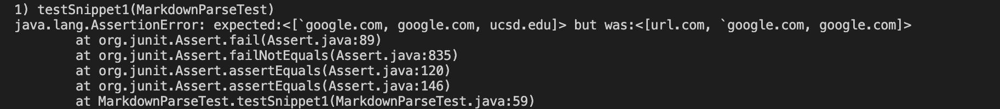
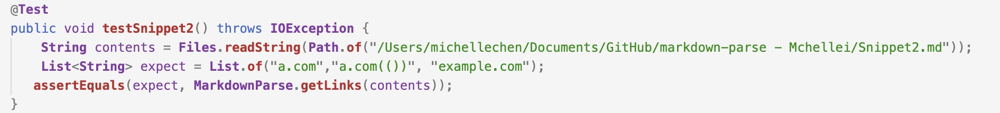
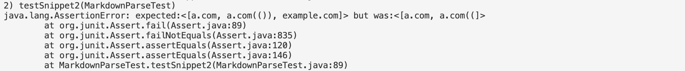
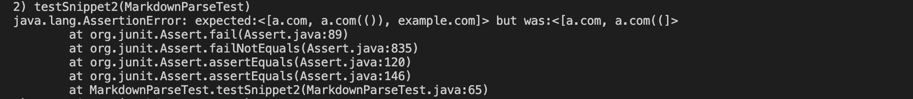
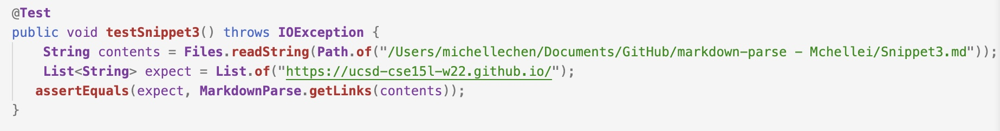
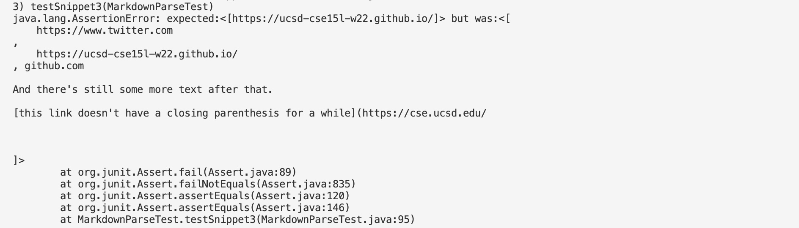
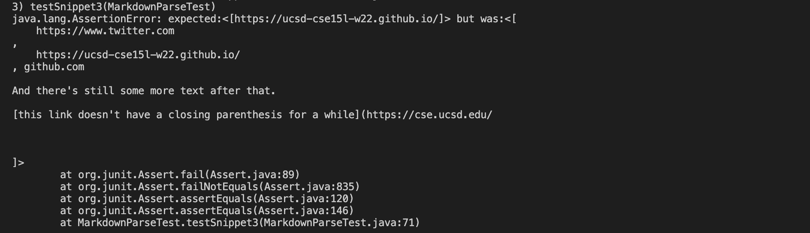

A link to my [markdown-parse repository](https://github.com/Mchellei/markdown-parse) and a link to the one I [reviewed](https://github.com/zhl010/markdown-parse).

## Snippet 1
The test that was implemented for Snippet 1 on my markdown-parse and on the one I reviewed. 

I expected the outcome to be:
`` `google.com``
`google.com`
`ucsd.edu`

This is the outcome of the test ran on my implementation, it did not pass.

This is the outcome of the test ran on the implementation I reviewed, it did not pass.

As the failure shows the test did not pass for both markdown-parse. 

I do not think that there is a small code change that would make my program work for Snippet 1 and all related cases. Looking for the backtick would require the program to not only look for pairing backtick when it encountered one. There also needs to be more effort to produce the correct output when there is no matching backtick or when there is multiple backtick on one line. 

## Snippet 2
The test that was implemented for Snippet 2 on my markdown-parse and on the one I reviewed. 

I expected the outcome to be:
`a.com`
`a.com(())`
`example.com`

This is the outcome of the test ran on my implementation, it did not pass.

This is the outcome of the test ran on the implementation I reviewed, it did not pass.

As the failure shows the test did not pass for both markdown-parse. 

I do not think there is a small code change that would work for Snippet 2 and all related cases with nest parentheses, brackets and escaped brackets. This will involve much more effort for all related cases to work since there is much things for the program to check for. Especially for escape brackets which the rules are very much different from regular brackets and parenthesis.

## Snippet 3
The test that was implemented for Snippet 3 on my markdown-parse and on the one I reviewed. 

I expected the outcome to be:
`https://ucsd-cse15l-w22.github.io/`

This is the outcome of the test ran on my implementation, it did not pass.

This is the outcome of the test ran on the implementation I reviewed, it did not pass.

As the failure shows the test did not pass for both markdown-parse. 

I do not think there is a small code change that would work for Snippet 3 and all related cases that have newlines in brackets and parenthesis. To check if there is a line break between the brackets would be a more involved change. I tried some possible fixes within the 10 lines range by attempting to have the program evaluate the value of the closed bracket but was unsuccessful. 