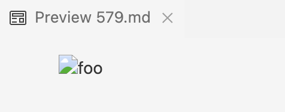

## Differences between two `markdown-parse`

To find the differences between the results by my implementation in `Mchellei-markdown-parse` and the given `markdown-parse` implementation I used the `diff` command. Using the `bash script.sh > results.txt` command I was able to run `bash` and save result into a file `results.txt`. 

As shown above I used `diff` command to find the differences in results produced by the two implementation by comparing the two `results.txt`.

## Test 1

This is one difference that I recognized based on what was printed by the `diff` command. 

The first test that had different results were by test `508.md`. 

`markdown-parse` did not recognize this as a valid link resulting in no output while my implementation recognized it as a valid link, with result `/url 'title "and" title"`. My implementation is accurate as shown by the preview in VSCode. 
This test's expected output:

`markdown-parse` could have an issue being unable to identify single quotation marks leading to it not recognizing the link. The program is unable to differentiate what's inside two single quotation marks leading to the error. A possible fix could be done to this block of code. 

## Test 2 

This is the second difference that I recognized based on what was printed by the `diff` command. 

The second test that had a different results were by test `577.md`. 

My implementation `Mchellei-markdown-parse` did not recognize this as a valid image link resulting no output while `markdown-parse` did recognize this as a valid link. `markdown-parse` implementation is accurate as shown by the preview in VSCode. This test's expected output:

My implementation could have an issue being unable to identify what is after an exclamation mark leading to it not recognizing image links as well as being unable to recognize extension such as `jpg` of images. A possible fix could be done to this block of code. 

