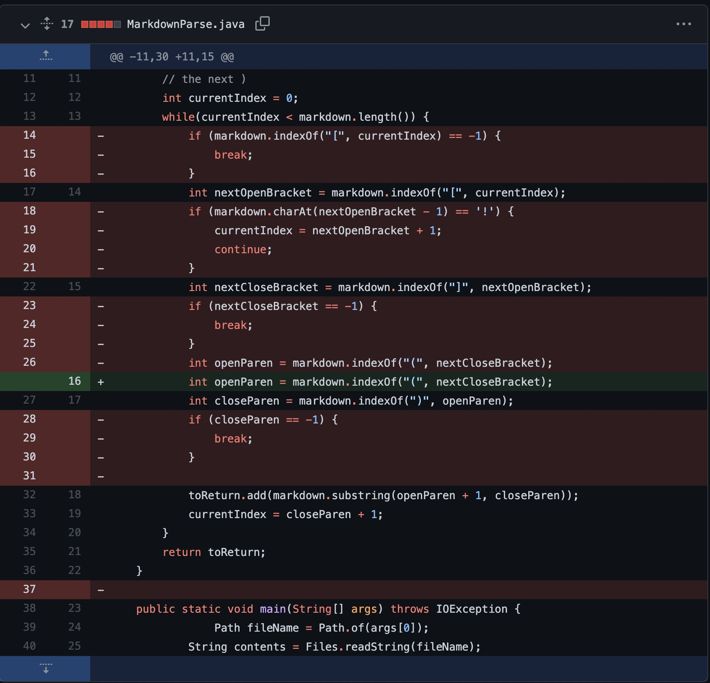
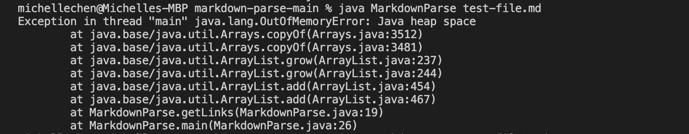
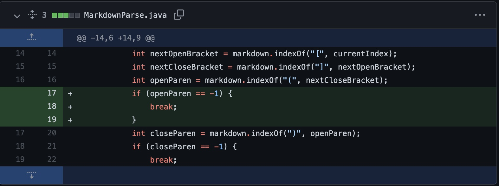
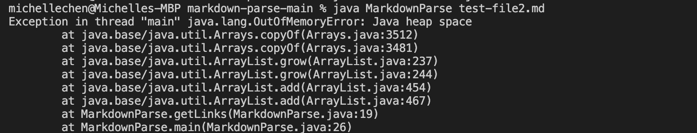
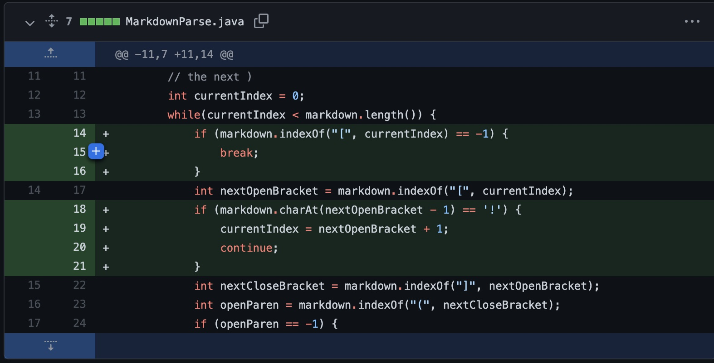
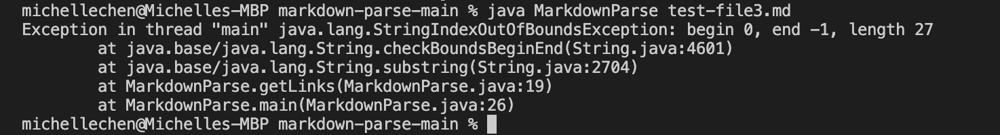

## Code Change 1

The first time the code was changed was when testing [test-file.md](https://github.com/Mchellei/markdown-parse/blob/bc1f8cfec85e6a63a52d54a223424dcd736bce99/test-file.md). Which a Java memory bug occured. When using the terminal to test, the output is shown bewlow. . This caused a Java heap space error and shows the program out of memory. The program

## Code Change 2

The second time the code was changed was when testing [test-file2.md](https://github.com/Mchellei/markdown-parse/blob/bc1f8cfec85e6a63a52d54a223424dcd736bce99/test-file.md). The same Java memory bug occured as the first test file. When using the terminal to test the output is shown below. . 

## Code Change 3 

The third time the code was changed was when testing [test-file3.md](https://github.com/Mchellei/markdown-parse/blob/bc1f8cfec85e6a63a52d54a223424dcd736bce99/test-file.md). An `StringIndexOutOfBoundsException` was thrown. 